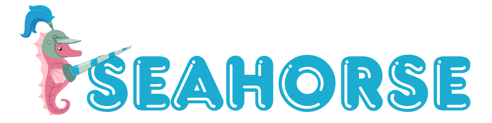

<p align="center"></p>


[](https://pypi.org/project/seahorse)
[](https://pypi.org/project/seahorse)

-----


**Table of Contents**

- [Guidelines](#installation)
- [Installation](#installation)
- [License](#license)

## Contributing guidelines

### Dev packages info

- Docstring VSCode package : [autodocstring](https://marketplace.visualstudio.com/items?itemName=njpwerner.autodocstring)
- Package backend : [hatch](https://hatch.pypa.io/)
- Docs with [pdoc](https://pdoc.dev/): 
  - (Re)generate docs `hatch env run gen-doc`
  - See doc without generating static `hatch env run serve-doc`

### Contributing

> *A Foolish Consistency is the Hobgoblin of Little Minds* - Ralph Waldo Emerson

- Please make a branch, a PR and wait for your code to be reviewed.
- **[WARN]** please use `[ctrl]+[shift]+F` on you edited files before committing to comply with most of [PEP8](https://peps.python.org/pep-0008/)'s rules. 


## Installation

```console
pip install seahorse
```

## License

`seahorse` is distributed under the terms of the [MIT](https://spdx.org/licenses/MIT.html) license.
