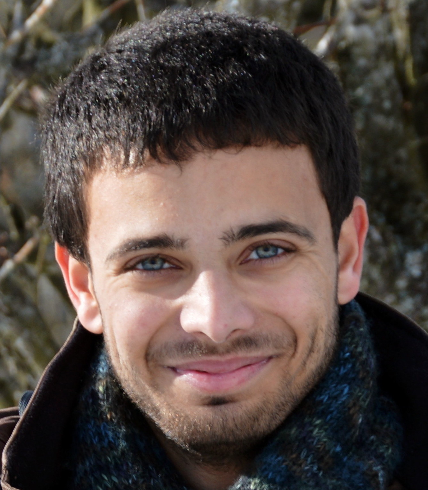
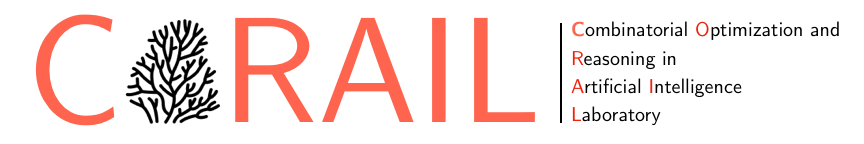

<span class="seahorse-text-blue large-text">SEAHORSE<span>

[](https://pypi.org/project/seahorse)
[](https://pypi.org/project/seahorse)


<a class="github-button" href="https://github.com/corail-research/seahorse/archive/HEAD.zip" data-size="large" data-icon="octicon-download" aria-label="Download corail-research/seahorse on GitHub">Download</a>
<a class="github-button" data-icon="octicon-star" href="https://github.com/corail-research/seahorse" data-size="large" data-show-count="true" aria-label="Star corail-research/seahorse on GitHub">Stars</a>
<a class="github-button" data-icon="octicon-issue-opened" href="https://github.com/corail-research/seahorse/issues" data-size="large" data-show-count="true" aria-label="Issue corail-research/seahorse on GitHub">Issue</a>
# A handy package for kickstarting AI contests

We proudly provide a Python framework that makes the building of an environment for adversarial search agents easy! 

A lot of fun functionalities are provided an easily usable out of the box! 

 - Implementing a new game setup from scratch? **Painless!**
 - Playing against remote agents? **Easy!** 
 - Generating and collecting data about played games? **Worriless!**
 - Organizing a contest for a large range of agents? **Quick and reliable!**

## Installation
The package is publicly available on PyPI.

We strongly encourage the use of a virtual environment:

```
    $ python3 -m venv venv

    $ source venv/bin/[activate|Activate.ps1]

    (venv)$ pip install seahorse

```

## Running the example

|Initial state|Intermediate state|Final state|
|:-:|:-:|:-:|
||||

An example implementation featuring the famous game of *tic-tac-toe* is available on the github repository under the branch with its name:

```shell
git clone https://github.com/corail-research/seahorse/ \
--branch tictactoe \
--single-branch tictactoe
```

Learn on how to launch the example and recreate one of your own through our [tutorials](tutorials/1-getting_started.md)

## Main contributors
We are an enthusiastic team of M.Sc candidates led by Pr. Quentin Cappart at Polytechnique Montréal. The package was originally developed in the context of a introductory course to artificial intelligence given to undergrad computer and software engineering students.

<div class="horizontal-container"> 
    <div class="card">
    
    <div class="container">
        <h4><b>Quentin <br>Cappart</b></h4>
        <p>Professor & team lead</p>
        <a href="https://www.linkedin.com/in/quentin-cappart/" target="_blank"><div class="lk-link"><span class="twemoji"></span></div></a>
    </div>
    </div>
    <div class="card">
    
    <div class="container">
        <h4><b>Amaury <br>Guichard</b></h4>
        <p>UX Design & architecture</p>
        <a href="https://www.linkedin.com/in/amaury-guichard-a558b617a/" target="_blank"><div class="lk-link"><span class="twemoji"></span></div></a>
    </div>
    </div>
    <div class="card">
    
    <div class="container">
        <h4><b>Loïc <br>Grumiaux</b></h4>
        <p>Networking & DevOps</p>
        <a href="https://www.linkedin.com/in/loïc-grumiaux-76b77121b" target="_blank"><div class="lk-link"><span class="twemoji"></span></div></a>
    </div>
    </div>
    <div class="card">
    
    <div class="container">
        <h4><b>Thomas <br>Jacquet</b></h4>
        <p>Algorithms & architecture</p>
        <a href="https://www.linkedin.com/in/thomas-jacquet/" target="_blank"><div class="lk-link"><span class="twemoji"></span></div></a>
    </div>
    </div>
    <div class="card">
    
    <div class="container">
        <h4><b>Louis <br>Gillon</b></h4>
        <p>Architecture & parallelization</p>
        <a href="https://www.linkedin.com/in/louis-gillon-281a8a161/" target="_blank"><div class="lk-link"><span class="twemoji"></span></div></a>
    </div>
    </div>
</div>

---------------------------------

<div class="horizontal-container"> <p></p> <p></p>  </div>


