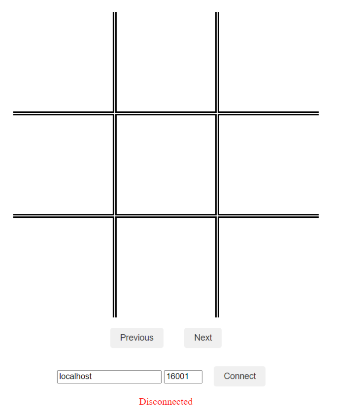
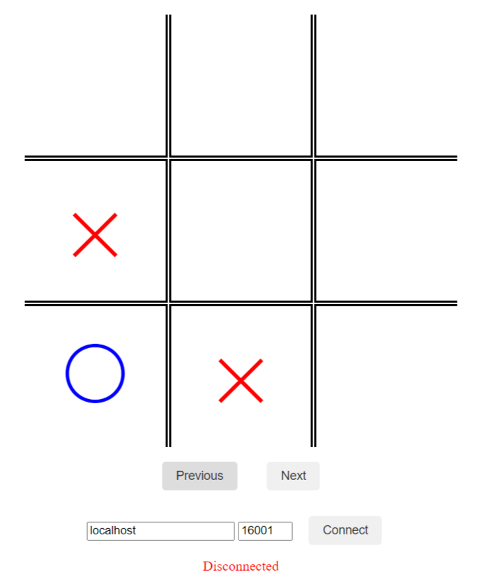
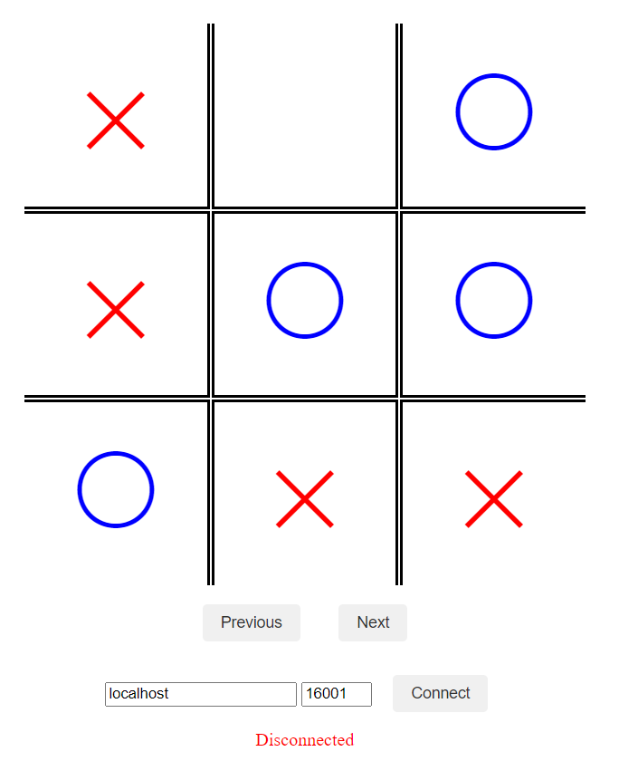
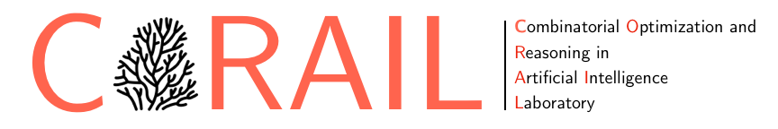

<span class="seahorse-text-blue large-text">SEAHORSE</span>

[](https://pypi.org/project/seahorse)
[](https://pypi.org/project/seahorse)


<a class="github-button" href="https://github.com/corail-research/seahorse/archive/HEAD.zip" data-size="large" data-icon="octicon-download" aria-label="Download corail-research/seahorse on GitHub">Download</a>
<a class="github-button" data-icon="octicon-star" href="https://github.com/corail-research/seahorse" data-size="large" data-show-count="true" aria-label="Star corail-research/seahorse on GitHub">Stars</a>
<a class="github-button" data-icon="octicon-issue-opened" href="https://github.com/corail-research/seahorse/issues" data-size="large" data-show-count="true" aria-label="Issue corail-research/seahorse on GitHub">Issue</a>

# A handy package for building turn‑based game environments for AI agents

We proudly provide a lightweight Python framework that makes it easy to create adversarial games and run matches with AI agents – whether they run **locally**, **in isolated processes**, **over a network**, or are **human‑controlled via a GUI**.

## Why Seahorse?

Developing a game environment for autonomous agents involves many repetitive tasks: managing turns, validating moves, enforcing time limits, handling player connections, and recording results.
Seahorse takes care of all that boilerplate, letting you focus on your game logic and agent strategies.

- **Define your own game** – describe the states, rules, possible moves, and winning condition.
- **Plug in any agent** – implement the decision logic once.
- **Interaction via proxies** - agents can compete whether they are all run locally or on another machine. human can also play against agent through an interactive GUI.
- **Let the master run the match** – the built‑in game master enforces turn order, time budgets, move legality, and determines winners.
- **Real‑time communication** – a server broadcasts game states and collects actions, making remote play and live recording effortless.

## Installation
The package is publicly available on [PyPI](https://pypi.org/project/seahorse).
We strongly recommend using a virtual environment:

```bash
python3 -m venv venv

# On Linux / macOS:
source venv/bin/activate

# On Windows (PowerShell):
# venv\Scripts\Activate.ps1

pip install seahorse
```

## Core concepts

Seahorse is built around a few simple ideas that work together seamlessly.

| Concept | What it does |
|---------|---------------|
| **[Game State][seahorse.game.game_state.GameState]** | Stores the active player, the environment representation, etc. It also encapsulate legal moves and game termination computation. |
| **[Action][seahorse.game.action.Action]** | A generic representation of a player move or decision during their turn that affect the current game state. |
| **[Player][seahorse.player.player.Player]** | The agent that receives the current game informations and returns an action. |
| **[Proxy][seahorse.player.proxies.PlayerProxy]** | A wrapper that runs an agent in a specific environment or allows human interaction with the game. The game master interact with agents only through their proxy. |
| **[Game master][seahorse.game.master.GameMaster]** | The referee that initialises the game, asks each proxy for an action on the player’s turn, validates the move, checks time limits, updates the state, and broadcasts everything with the event master singleton. |
| **[EventMaster][seahorse.game.io_stream.EventMaster]** | A WebSocket server that all proxies and listeners connect to. It relays game states and receives actions, enabling real‑time remote play and recording. All clients identify themselves, and the hub routes messages accordingly. |

Seahorse also provide several utilities in the form of JSON serialization for all core objects, custom exceptions for game mechanics, or recorders for logging game traces.
Please consider reading the [overview](overview/index.md) section for further informations.

## Example: Tic‑Tac‑Toe

|Initial state|Intermediate state|Final state|
|:-:|:-:|:-:|
||||

A complete implementation of Tic‑Tac‑Toe is available in the [seahorse-zoo](https://github.com/corail-research/seahorse-zoo/) repository. It demonstrates how to define the game state, possible actions, and a simple minimax agent.

Follow our **[tutorials](tutorials/1-getting_started.md)** to learn how to run the example and create your own game.

```shell
```

## Main contributors
We are an enthusiastic team of M.Sc. and PhD candidates led by Pr. Quentin Cappart at Polytechnique Montréal.
The package was originally developed in the context of an introductory course to artificial intelligence given to computer and software engineering students.

<div class="grid cards narrow-grid" markdown>

-   

    ### Quentin Cappart

    [:fontawesome-brands-linkedin:](https://www.linkedin.com/in/quentin-cappart/){ .icon-link target="_blank" }
    [:fontawesome-brands-github:](https://github.com/qcappart){ .icon-link target="_blank" }
    [:material-web:](https://qcappart.github.io/){ .icon-link target="_blank" }

-   

    ### Hugo Barral

    [:fontawesome-brands-linkedin:](https://www.linkedin.com/in/hugo-barral/){ .icon-link target="_blank" }
    [:fontawesome-brands-github:](https://github.com/arc-hugo){ .icon-link target="_blank" }

-   

    ### Amaury Guichard

    [:fontawesome-brands-linkedin:](https://www.linkedin.com/in/amaury-guichard-a558b617a/){ .icon-link target="_blank" }
    [:fontawesome-brands-github:](https://github.com/RevenMyst){ .icon-link target="_blank" }

-   

    ### Loïc Grumiaux

    [:fontawesome-brands-linkedin:](https://www.linkedin.com/in/loïc-grumiaux-76b77121b/){ .icon-link target="_blank" }
    [:fontawesome-brands-github:](https://github.com/l9kd1){ .icon-link target="_blank" }

-   

    ### Louis Gillon

    [:fontawesome-brands-linkedin:](https://www.linkedin.com/in/louis-gillon-281a8a161/){ .icon-link target="_blank" }
    [:fontawesome-brands-github:](https://github.com/gillonlo){ .icon-link target="_blank" }

-   

    ### Thomas Jacquet

    [:fontawesome-brands-linkedin:](https://www.linkedin.com/in/thomas-jacquet/){ .icon-link target="_blank" }
    [:fontawesome-brands-github:](https://github.com/Thomasj17){ .icon-link target="_blank" }

-   

    ### Emile Jehaes

    [:fontawesome-brands-linkedin:](https://www.linkedin.com/in/emile-jehaes-187776282/){ .icon-link target="_blank" }
    [:fontawesome-brands-github:](https://github.com/milo3141592){ .icon-link target="_blank" }

-   

    ### Yoann Sabatier Montanaro

    [:fontawesome-brands-github:](https://github.com/YoannSab){ .icon-link target="_blank" }

</div>

---------------------------------

<div class="horizontal-container"> <p></p> <p></p>  </div>


