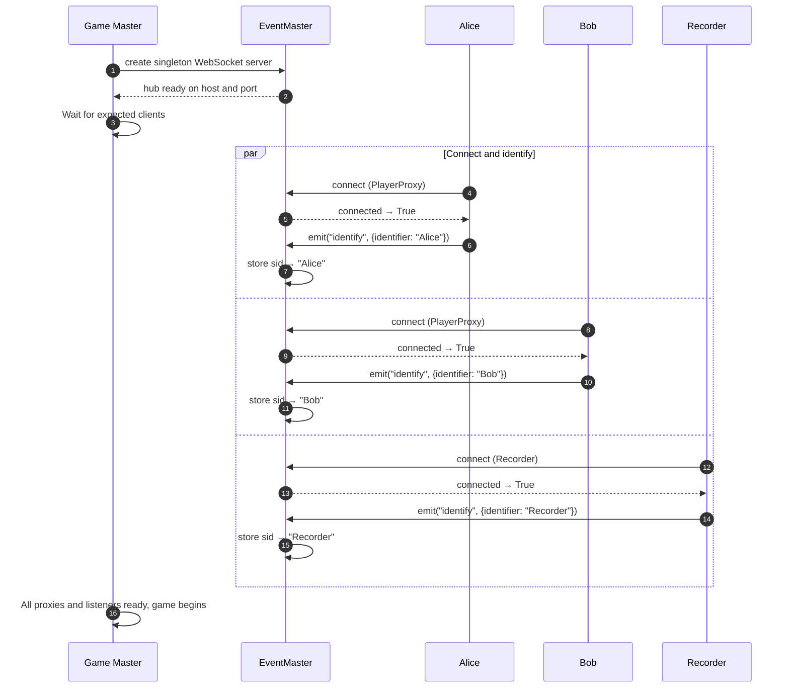
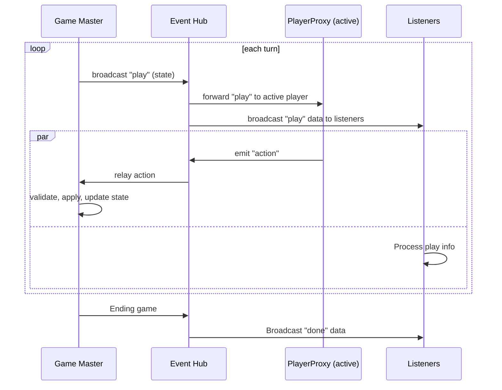

# Architecture

Seahorse follows a **centralized topology** where the game master orchestrates the match.
All communication flows through a single event hub, even for local objects.
This section explains how connections are established, why this design was chosen, and what happens during a match.

## How connections are established

The diagram below shows the **setup phase**: the game master creates the hub, then proxies and optional listeners connect and identify themselves.

The **game master** calls [`get_instance`][seahorse.game.io_stream.EventMaster.get_instance] to create a **singleton** WebSocket server on a given host/port.
Each **player proxy** connects to the hub over WebSocket.
The proxy sends an `"identify"` event with its unique identifier (e.g., `"Alice"`).
The hub stores a mapping from session ID to identifier.
This behavior helps the game master to identify which player needs to play and receive an action.
**Listeners** (spectators, recorders) can also connect and are also identified.
They receive the same event broadcasts but never send actions.
When all expected proxies are ready, the game begins.

## Component responsibilities

We explain the role of each core component in the architecture.

| Component | Role |
|-----------|------|
| [**GameMaster**][seahorse.game.master.GameMaster] | Act as the referee and the coordinator. Runs the turn loop, activate the computation of the active player, validates moves, tracks time, disqualifies players, and determines winners. |
| [**EventMaster**][seahorse.game.io_stream.EventMaster] | Singleton WebSocket server that act as the event hub. Broadcasts game states, receives actions, and routes messages to the correct proxy and listeners. |
| [**EventSlave**][seahorse.game.io_stream.EventSlave] | Client‑side WebSocket connection handler. Manages the connection to the `EventMaster`, sends identification, receives events, and provides a communication channel for its wrapper. |
| [**PlayerProxy**][seahorse.player.proxies.PlayerProxy] | Wrapper for an agent. Provides a uniform [play()][seahorse.player.proxies.PlayerProxy.play] interface. |

## Why a centralized topology?

The code uses a **single [`EventMaster`][seahorse.game.io_stream.EventMaster] singleton** per process. This design was chosen for several reasons:

- **Separation of concerns** – Game logic knows nothing about how or where agents run.
- **Uniform communication** – All interaction goes through the event hub using JSON‑serialised messages.
- **Easy addition of listeners** – Spectators, recorders, or analytics tools can connect and receive all game events without modifying the game logic.
- **Controlled message routing** – The hub knows which session belongs to which client (via identification).
  It can forward events only to the right clients and ignore messages from unauthorised senders.
- **Asynchronous by nature** – Built on [`asyncio`][], [`aiohttp`](https://docs.aiohttp.org/en/stable/) and [`socketio`](https://python-socketio.readthedocs.io/en/stable/), the hub handles many concurrent connections efficiently.

## Message flow during a match
Here is a high‑level overview of what happens during play turns.
The game master orchestrates everything, but the **event hub** is responsible for routing messages.

Each turn begins with the game master broadcasting the current state to the event hub.
The hub forwards this `"play"` event to the active player’s proxy and simultaneously broadcasts it to all connected listeners.
The player proxy computes an action and emits an `"action"` event back to the hub, which relays it to the master while listeners can process the state data.
The master validates the action, applies it to the game state, deducts time, and updates the state.
When the game ends, the master sends a `"done"` event through the hub, which broadcasts it to all listeners.

---

## See also

- [Game Design](game-design.md) – for defining game state, actions, and rules.
- [Agent and Proxies](agents-proxies.md) – for how agents are wrapped and run.
- [Networking and Communication](networking-communication.md) – for JSON serialisation and listeners description.
- [Time Limits and Fairness](time-fairness.md) – for timeout enforcement and disqualification.
- [API Reference – EventHub][seahorse.game.io_stream.EventMaster]
