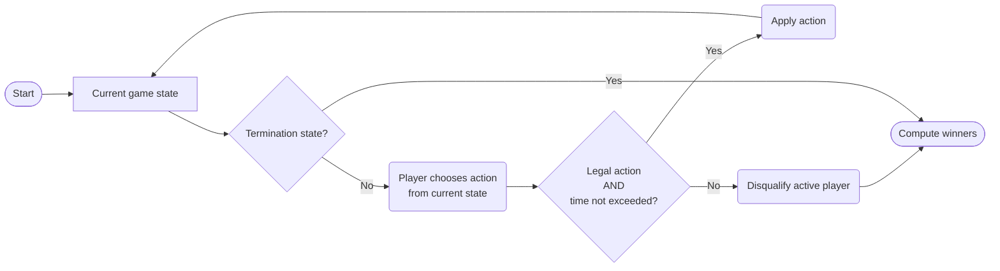
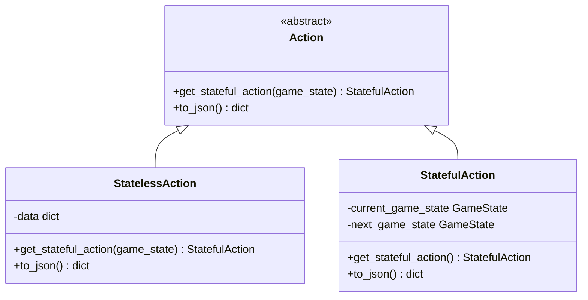

# Game Design

To create a new game with Seahorse, you need to define three core aspects.
The diagram below shows how they relate.

## Game design in three steps

### How to define the [GameState][seahorse.game.game_state.GameState]

The game state is the core data structure that holds everything about the current match.
We recommend you to create a subclass and implement all the abstract functions that generate available actions, apply action to a state, compute termination and winners.
There's a few questions that need to be answered when designing your game state.

#### What information is needed to describe a state?

These information are essential to design agents with a coherent decision logic.
The configuration of a game state is usually described in a [`Representation`][seahorse.game.representation.Representation] object.
A game state contains a representation by default and game designers need to subclass the base class to add their own game logic.
Classes from the `game_layout` directory like [`Board`][seahorse.game.game_layout.board.Board] can help you bootstrap your own game representation.
A state also indicate whose [player is active][seahorse.game.game_state.GameState.get_active_player] and need to make an action.
Feel free to also add any attributes and functions in your subclass that helps characterize the state.
This can be useful when your game needs to capture extra rules‑driven variables that are not directly visible from the representation but influence actions or termination.
We encourage to restrict your implementation to essential informations only for a better memory footprint.

??? tip "What's inside a game state representation..."

    === "... for a Chess game"

        | Element | Information |
        |---------|-------------|
        | Pieces | Describe every game pieces still in play with their role (King, Queen, Knight, etc.), color and position on the board. |
        | Discards | Piece captured by the opponent during the game |

    === "... for a Connect Four game"

        | Element | Information |
        |---------|-------------|
        | Pieces | Describe every game pieces still in play with their color and position on the grid . |
        | Remaining | Remaining pieces for each player. |

    === "... for a Mancala game"

        | Element | Information |
        |---------|-------------|
        | Pits | How many seeds are in each pit. |
        | Stores | How many seeds are in each player store. |

    Please do note that this is only our interpretation and that it can encapsulate only some part of the described game.

#### When does the game end and who wins?
A game state need to be aware if they are terminal or not.
You have to implement the [`is_done()`][seahorse.game.game_state.GameState.is_done] function that returns `True` if the game is over.
Common conditions can include maximum moves reached, winning move from a player, reaching a maximum score, etc.
Once in a terminal state, compute the list of winning players (multiple winners possible).
Seahorse automatically disqualify players that produce an error, exceed time or return an illegal action and declare all other players as winners.
You can override this behaviour by subclassing the [`GameMaster`][seahorse.game.master.GameMaster].

#### How do you compare and hash states?
Two states are equal if they represent the exact same situation.
This is essential for detecting repeated positions (e.g., threefold repetition in chess) and to allow caching for your players.
A good hash allows fast lookups in transposition tables.
The hash should be based only on the essential game data, not on ephemeral values.
Seahorse use a predefined [`__hash__`][seahorse.game.game_state.GameState.__hash__] function for game state that use the [`Representation`][seahorse.game.representation.Representation] hash.
Hash is also used for equality comparison. 
We invite game designers to design their [`Representation`][seahorse.game.representation.Representation] class to produce hashable objects or to override the hash function if necessary.

#### How can you trasmit your states?
Seahorse need to transmit game state to all proxies and listeners, this is achieved by serializing them to JSON-like format.
[`Serializable`][seahorse.utils.serializer.Serializable] objects need to implement [`to_json`][seahorse.utils.serializer.Serializable.to_json] and [`from_json`][seahorse.utils.serializer.Serializable.from_json] methods.
This allows to enforce one general format compatible with a large kind of transmission methods from simple argument pass to network communication.

### How to define the actions

From any non‑terminal state, the game must be able to determine all actions the active player can make.
An **action** represents a move or a decision that a player can make.
Seahorse provides two complementary action types, unified under a common interface.
The class diagram below shows how they relate.

#### What kind of action do you need?

=== "StatefulAction"

    [`StatefulAction`][seahorse.game.stateful_action.StatefulAction] is the most concrete representation of an action that contains the state before the action and the one generated by the action.

    - Stores **both** the current game state and the resulting game state after the move.
    - Heavier because it contains full state snapshots.
    - Used by the game master for validation, debugging and when player want a complete representation of actions and their results.

    ??? info "Stateful in Tic‑Tac‑Toe"  

        Contains the board before the move and the board after placing X at (1,2).

=== "StatefulAction"

    [`StatelessAction`][seahorse.game.stateless_action.StatelessAction] only represent the action 'data' and is not bound to a specific state.

    - Stores only the **parameters** of the move.
    - Can be applied to multiple state if valid.
    - Very lightweight
    - Data must be serializable.
    - Used in network transmission, large action spaces, and when player want to keep action representation.

    ??? info "Stateless in Tic‑Tac‑Toe"  

        Action data can by represented by a simple dictionary `{"type": "X", "row": 1, "col": 2}`.
        This data is applied to an existing state to generate one of its successor (if valid).

#### What should you implement?
Those predefined class reduce the amount of work for game designer.
You mostly need to focus on three elements:

- Define minimal hashable informations of an action to standardize [`StatelessAction`][seahorse.game.stateless_action.StatelessAction] data dictionnary.
- In your [`GameState`][seahorse.game.game_state.GameState], implement [`apply_action()`][seahorse.game.game_state.GameState.apply_action] – this takes the lightweight action and returns the new state.
- Implement [`generate_possible_stateless_actions()`][seahorse.game.game_state.GameState.generate_possible_stateless_actions] and [`generate_possible_stateful_actions()`][seahorse.game.game_state.GameState.generate_possible_stateful_actions] – generators that yields every legal [`StatelessAction`][seahorse.game.stateless_action.StatelessAction] and [`StatefulAction`][seahorse.game.stateful_action.StatefulAction] from the current state.

### How to define the rules

---

## What you don't have to worry about

Seahorse takes care of many repetitive and error‑prone tasks, so you can focus on game design.

- **Turn order** – The game master automatically rotates through the list of players you provide. You don’t need to write any code to switch turns.

- **Move validation** – The master checks that the action returned by a proxy is actually in the list of legal actions for the current state. If not, the player is disqualified. You don’t have to validate again inside your game logic (though you may still do so for safety).

- **Time limits** – Each player is given a time budget (e.g., 60 seconds for the entire match). The master measures the time taken by each move and subtracts it from the remaining budget. If a player exceeds their budget, they are automatically disqualified. No manual timing code needed.

- **Network communication** – The event hub and proxies handle all WebSocket connections, JSON serialisation, and message routing. Whether an agent runs locally, in a separate process, or on another continent, the game master interacts with it through the same uniform [`play()`][seahorse.player.proxies.PlayerProxy.play] interface. You never write socket code yourself.

- **Recording and replay** – By attaching a [recorder listener][seahorse.utils.recorders.StateRecorder] to the event hub, every game state, action, and final result can be logged to a file (e.g., JSON Lines format). This is useful for debugging, analysis, or building training datasets. You don’t have to implement logging inside your game.

- **Exception safety** – The master catches agent exceptions (timeout, illegal action, crash) and disqualifies the player without crashing the whole match. Your game logic only needs to handle valid moves; the master handles the rest.

!!! info "Overrinding predefined"

    Seahorse already implement some default behavior but you can always override them if necessary.
    For example, turn order is computed by the game state and can thus can be overriden.
    It can be useful to implement games where some actions skip turns or make the same player directly take another turn.
    We also encourage contributing to Seahorse to make it more generic and easily tuned to your needs.

---

## See also

- [Architecture](architecture.md) – for the overall system design and message flow.
- [Agent and Proxies](agents-proxies.md) – for implementing agents and choosing proxies.
- [Networking and Communication](networking-communication.md) – for serialisation and event protocols.
- [Time Limits & Fairness](time-fairness.md) – for how time budgets work.
- [API Reference – GameState][seahorse.game.game_state.GameState]
- [API Reference – Action][seahorse.game.action.Action]
