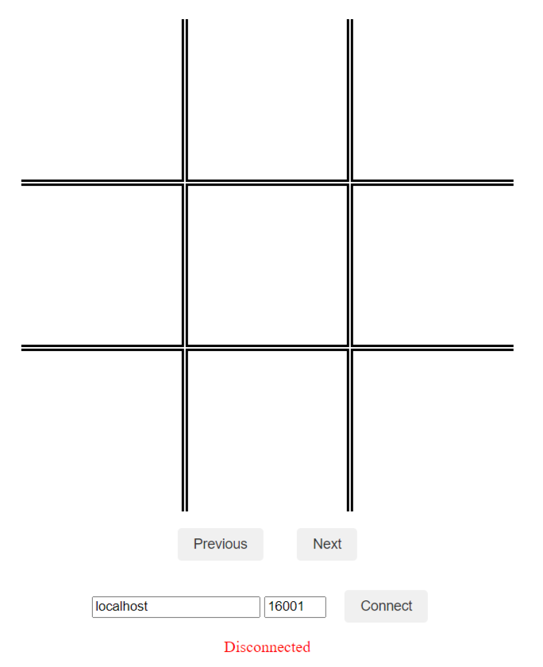
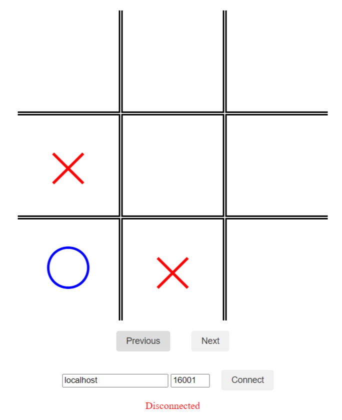
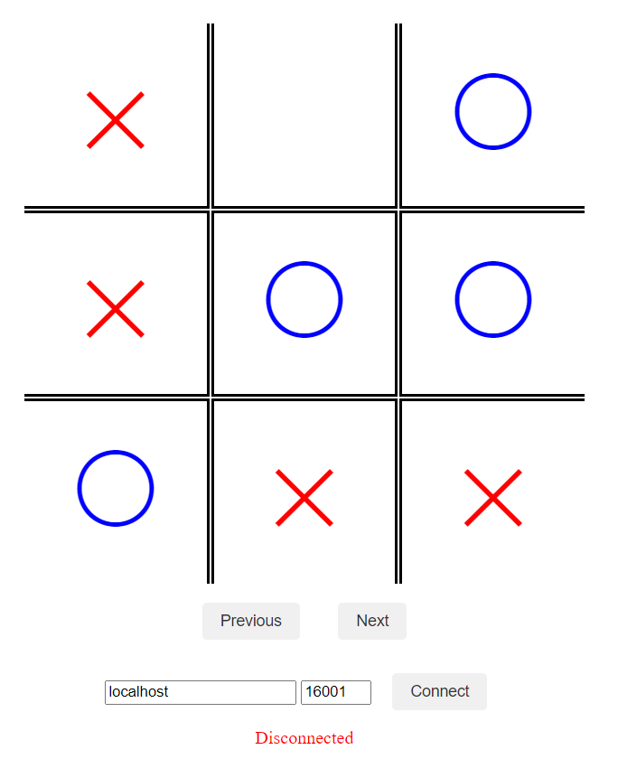
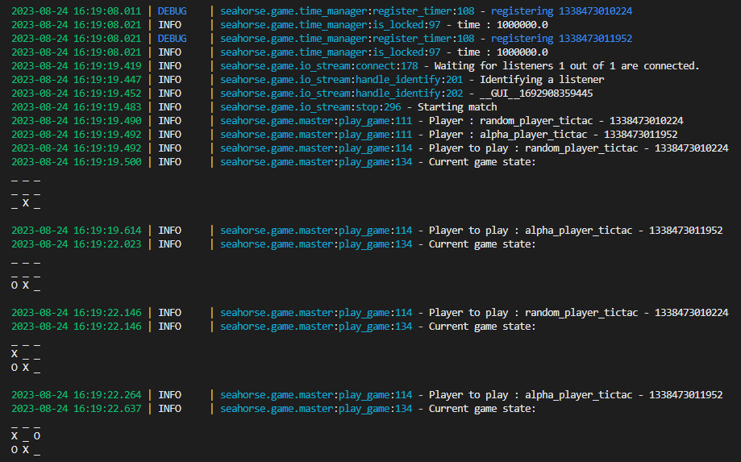

#1 - Getting started
One simple way to get started is to play with the example first, let's quickly grab it from Seahorse's github repository:

```shell
git clone https://github.com/corail-research/seahorse/ \
--branch tictactoe \
--single-branch tictactoe
```

Once this is done just dive in, install seahorse if it's not already done and just launch a match between two of our pre-made autonomous agents.

```shell
cd tictactoe
pip install -r requirements.txt
python main_tictac.py -t local random_player_tictac.py alpha_player_tictac.py 
```
A graphic interface should then appear in your browser.

|Initial state|Intermediate state|Final state|
|:-:|:-:|:-:|
||||

`seahorse` is the perfect framework to facilitate the implementation of adversarial agents. It helps developer to focus only on the very specific mechanics of the environment in which their agent will evolve. You don't lose time on game logic or execution utilities anymore. It has several features which includes for instance a multi-level log system, a game recorder, and a responsive GUI,.


